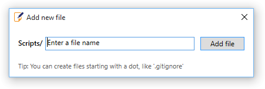
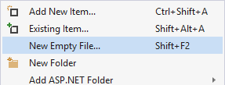

# Add Any File

**Download** this extension from the [VS Marketplace](https://marketplace.visualstudio.com/items?itemName=MadsKristensen.AddNewFile64)
or get the [CI build](https://www.vsixgallery.com/extension/d48e8f25-661b-4970-8b66-03f051ba5fc3).

-----------------------------------

A Visual Studio extension for easily adding new files to any project. Simply hit Shift+F2 to create an empty file in the
selected folder or in the same folder as the selected file.

### Features

- Easily create any file with any file extension
- Create files starting with a dot like `.gitignore`
- Create deeper folder structures easily if required
- Create folders when the entered name ends with a /

### Show the dialog

A new button is added to the context menu in Solution Explorer.

You can either click that button or use the keybord shortcut **Shift+F2**.

### Create folders

Create additional folders for your file by using forward-slash to
specify the structure.

For example, by typing **scripts/test.js** in the dialog, the
folder **scripts** is created if it doesn't exist and the file
**test.js** is then placed into it.

### Custom templates

Create a `.templates` folder at the root of your project.
The templates inside this folder will be used alongside the default ones.

#### Keywords
Inside the template those keywords can be used:
- `{itemname}`: The name of the file without the extension
- `{namespace}`: The namespace

#### Types of template
3 types of template are available:

##### Exact match
When creating the file `Dockerfile`, the extension will look for `dockerfile.txt` template.

##### Convention match or Partial match
If you create a template with the name `repository.txt`, then it will be used when creating a file ending with `Repository` (eg: DataRepository).

##### Extension match
When creating the file `Test.cs`, the extension will look for `.cs.txt` template.

### How can I help?
If you enjoy using the extension, please give it a ????? rating on the [Visual Studio Marketplace][marketplace].

Should you encounter bugs or if you have feature requests, head on over to the [GitHub repo][repo] to open an issue if one doesn't already exist.

Pull requests are also very welcome, since I can't always get around to fixing all bugs myself. This is a personal passion project, so my time is limited.

Another way to help out is to [sponser me on GitHub](https://github.com/sponsors/madskristensen).
